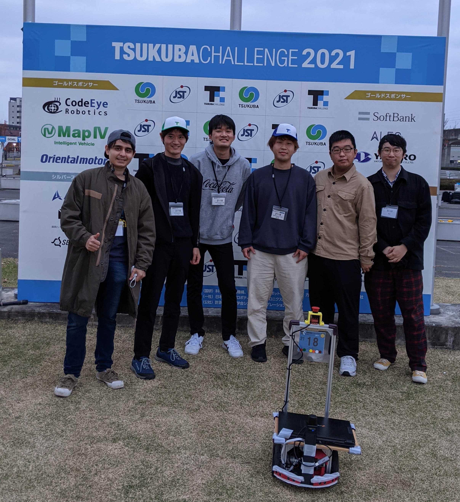
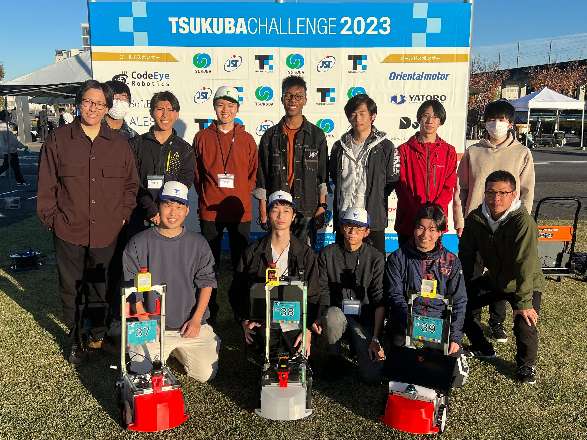

# 受賞・参加歴

## AWS Robot Delivery Challenge 2020 優勝
* [NEWS CIT 2020.10.15](https://www.it-chiba.ac.jp/cit_news/media/201015/topics2.html)
* [AWS Robot Delivery Challenge 決勝戦・表彰式（YouTube）](https://youtu.be/Tvhe4P3MiTU?si=NPvNbanKaDBFO9ij)

## AWS Robot Delivery Challenge 2021 準優勝
* [NEWS CIT 2021.7.15](https://www.it-chiba.ac.jp/cit_news/media/210715/topics4.html)
* [AWS Robot Delivery Challenge 2021 決勝トーナメント（YouTube）](https://youtu.be/yFObX4eaPmM?si=lm1gNlYmZxdkXxBT)

## 第5回自動運転AIチャレンジ2022（シミュレーション: チャレンジコース） 優勝
* [NEWS CIT 2023.4.15](https://www.it-chiba.ac.jp/media/230415matome.pdf)
* [第5回自動運転AIチャレンジ2022（シミュレーション）結果発表](https://www.jsae.or.jp/press/detail/133/)

## つくばチャレンジ

### つくばチャレンジ2021　[本走行](https://docs.google.com/spreadsheets/d/1C3lIzUWgnPAOi9Wp_jbiVvLjq58kTXwlD9ImyOVQVT0/edit#gid=0)
* メンバー
    * M2: Antonio
    * M1: 曹越
    * B4: 池邉、内田
    * B3: 出野、畑中

### つくばチャレンジ2022　[本走行](https://docs.google.com/spreadsheets/d/1Q9MRoooxMhpAoNS95CQBbr5OWdB2zBqvzQQPwV4EhVk/edit#gid=0)
* メンバー
    * M1: 池邉、内田
    * B4: 畑中
    * B3: 青木、新井、臼井、庄司、登内、松井、山崎
    * B2: 藤崎

### つくばチャレンジ2023　[本走行](https://docs.google.com/spreadsheets/d/1Iwiom74RXUaim666K_eI-7d6sHzKRmSGfxxx09hqwGI/edit#gid=0)
* メンバー
    * M2: 池邉、内田
    * M1: 畑中
    * B4: 青木、新井、臼井、庄司、登内、松井、山崎、吉越
    * B3: 川原、佐々木、茂、永木、藤崎、三浦

