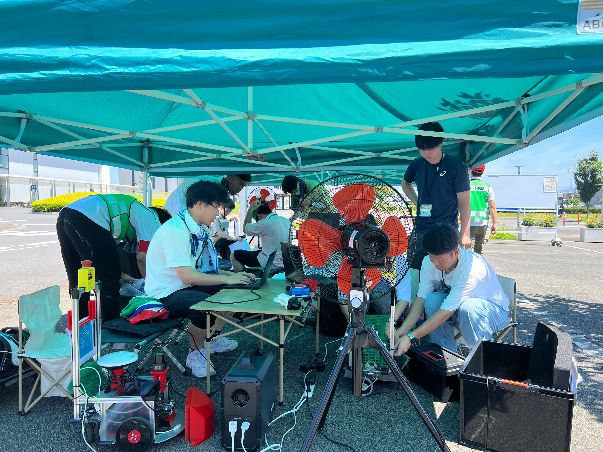

# 上田研究室　自律移動チーム

## 活動内容

屋内外で安定して小さい移動ロボットを自律走行させるためのソフトウェアを研究しています。

- ロボットが様々な環境で安定して自律走行できるようなアルゴリズム
- 屋内と屋外の環境での違いや、障害物の検出・回避、地形の変化に対する適切な制御方法
- 自己位置推定が破綻した際のリセット方法

## 更新

| 日付 | 内容 |
|:---- |:---- |
| 2024-06-25 | 価値反復の実験動画を掲載    <iframe width="560" height="315" src="https://www.youtube.com/embed/eiEJMcfNHPQ?si=nTvZrqRrKHcs9m1W" title="YouTube video player" frameborder="0" allow="accelerometer; autoplay; clipboard-write; encrypted-media; gyroscope; picture-in-picture; web-share" referrerpolicy="strict-origin-when-cross-origin" allowfullscreen></iframe> |

